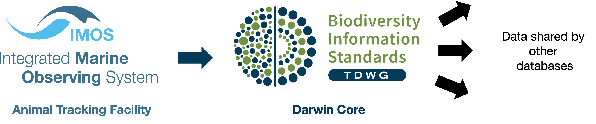

[](https://github.com/IMOS-AnimalTracking/remora)
[](https://github.com/IMOS-AnimalTracking/IMOS-ATF-to-DC-converter/issues)
[](https://github.com/IMOS-AnimalTracking/IMOS-ATF-to-DC-converter)
[](https://github.com/IMOS-AnimalTracking/IMOS-ATF-to-DC-converter)
[](https://github.com/IMOS-AnimalTracking/IMOS-ATF-to-DC-converter)

# IMOS Animal Tracking acoustic to Darwin Core conversor

<h1 align="center"><span style="color:#BEBEBE">re</span><span style="color:#808080"><b>mo</b></span><span style="color:#BEBEBE">ra</span></h1>
<h4 align="center">A shiny R app to transform between IMOS Animal Tracking acoustic to Darwin Core format</h4>

<p align="center">
  <a href="#overview">Overview</a> •
  <a href="#installation">Installation</a> •
  <a href="#key-functionalities">Key functionalities</a> •
  <a href="#what-to-do-if-you-encounter-a-problem">Issues</a> •
  <a href="#how-to-contribute">Contributions</a> •
  <a href="#acknowledgements">Acknowledgements</a> •
  <a href="#data-accessibility">Data accessibility</a> •
  <a href="#licence">Licence</a>
</p>

<br>

## Overview

[Darwin Core](https://dwc.tdwg.org/) is a standard intended to facilitate the sharing of information about biological diversity. This **Shiny R app** enables the conversion between **IMOS acoustic telemetry data** into Darwin Core, so that the data can be shared with other databases.

The acoustic telemetry data collected by the [IMOS Animal Acoustic Telemetry Database](https://animaltracking.aodn.org.au/) are quality-controlled every six months. While the complete quality-controlled dataset contains millions of rows of aquatic animals occurrence, a summarised version (aggregated with **daily resolution**, **per animal**, and at **acoustic receiver level**) has been created to facilitate manipulation and enable broad-picture data analyses including multiple species and large geographical areas. The objective of this app is to provide a tool to convert from the **IMOS Animal Tracking Facility quality controlled summarised data** format to **Darwin Core**, so that this ongoing dataset can be shared by other databases:

<p align="center">
  
</p>


## Installation

This Shiny app requires R version >= 3.6.0

You will need to download the app as a zip file by clicking on the **green button "Code"** and then **Download ZIP**:

<p align="center">
  
</p>

After extracting the folders from the zip file downloaded, go to the **Converter folder** and double click the **app.R** file. To initialize the app please type the following code into the R console:

```r
shiny::runApp()
```

<p align="center">
  
</p>


## Key functionalities

To process the **IMOS quality controlled summarised data**, please first download the latest version of the files from the **Australian Ocean Data Network** catalogue here. 

In the app, you will need to provide the folder where these files were downloaded in your computer, using the **Select input folder** button. 

Next you will need to provide the folder where you would like to export the processed **Darwin Core** files using the **Select output folder** button. 

After selecting both the input and output folders, please click the **Convert files** button to process the files.


## What to do if you encounter a problem

If you are convinced you have encountered a bug or
unexpected/inconsistent behaviour when using this shiny app, you can post an
issue [here](https://github.com/IMOS-AnimalTracking/IMOS-ATF-to-DC-converter/issues). First, have a read through the posted issues to see if others have encountered the
same problem and whether a solution has been offered. You can reply to an existing issue if you have 
the same problem and have more details to
share or you can submit a new issue. 

To submit an issue, you will need to *clearly* describe the issue, include a reproducible example, describe what you expected to happen (but didn’t), and provide screenshots/images that illustrate the problem.


## How to Contribute

Contributions from anyone in the Movement Ecology/Acoustic Telemetry
communities are welcome. Consider submitting a feature request
[here](https://github.com/IMOS-AnimalTracking/IMOS-ATF-to-DC-converter/issues/new/choose) to start
a discussion. Alternatively, if your idea is well-developed then you can
submit a pull request for evaluation
[here](https://github.com/IMOS-AnimalTracking/IMOS-ATF-to-DC-converter/pulls).


## Acknowledgements

This work was funded by Australia’s Integrated Marine Observing System (IMOS, www.imos.org.au). IMOS is enabled by the National Collaborative Research Infrastructure Strategy (NCRIS). It is operated by a consortium of institutions as an unincorporated joint venture, with the University of Tasmania as Lead Agent. 

## Data accessibility
- Continental-scale acoustic telemetry data collated as part of Australia’s Integrated Marine Observing System (IMOS) are available via the [IMOS Australian Animal Acoustic Telemetry Database](https://animaltracking.aodn.org.au). 

- Environmental and oceanographic datasets are available from the [IMOS Australian Ocean Data Network](https://portal.aodn.org.au/).


## Licence

 GNU General Public License (GPL>=3) https://www.gnu.org/licenses/gpl-3.0.en.html

<br>

**Contributors:**  

**Yuri Niella** @YuriNiella (IMOS Animal Tracking Facility, Sydney Institute of Marine Science)  
